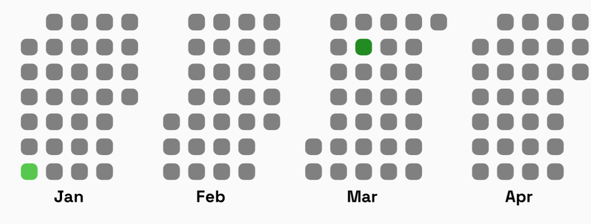
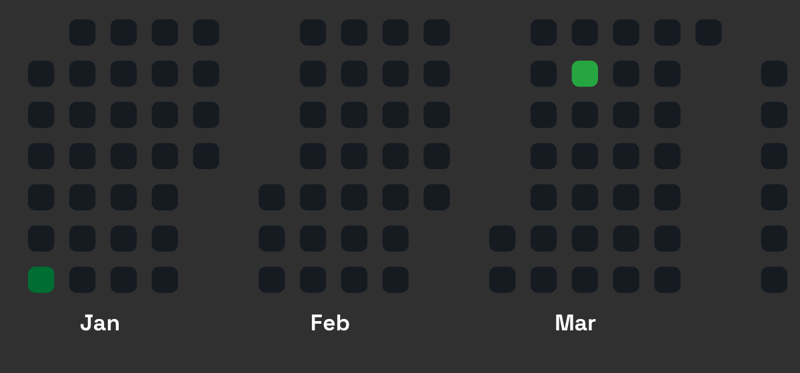

# Heatmap Component - NPM Package

## Overview
The `rn-heatmap` package provides a customizable activity heatmap similar to GitHub's contribution graph, built with `react-native-svg`.

## Installation

```sh
npm install rn-heatmap
```

or with Yarn:

```sh
yarn add rn-heatmap
```

### Peer Dependencies
Ensure you have `react-native-svg` installed:

```sh
npm install react-native-svg
```

## Usage

### Light Mode Component

```tsx
import React from 'react';
import { View } from 'react-native';
import {Heatmap} from 'rn-heatmap';

const LightModeHeatmap = () => {
  return (
    <View>
      <Heatmap
        year={2024}
        activeDays={[
          {monthIndex: 0, dayIndex: 5, level: 2},
          {monthIndex: 2, dayIndex: 10, level: 3},
          {monthIndex: 5, dayIndex: 20, level: 1},
        ]}
        defaultCellColor="#808080"
        colorMap={{
          1: '#a3d9a5',
          2: '#57c84d',
          3: '#228b22',
        }}
        cellSize={12}
        dayGap={6}
        monthlyGap={30}
        textPadding={10}
        fontWeight="bold"
        getMonthAnnotation={monthIndex =>
          [
            'Jan',
            'Feb',
            'Mar',
            'Apr',
            'May',
            'Jun',
            'Jul',
            'Aug',
            'Sep',
            'Oct',
            'Nov',
            'Dec',
          ][monthIndex]
        }
        showMonthAnnotation={true}
        monthlyAnnotationFontSize={12}
        monthlyAnnotationColor="black"
        cellBorderRadius={4}
        paddingHorizontal={15}
        paddingVertical={5}
        bottomPadding={15}
        showCurrentFullYear={true}
        showScrollBar={true}
      />
    </View>
  );
};

export default LightModeHeatmap;
```
---



---

### Dark Mode Component

```tsx
import React from 'react';
import { View } from 'react-native';
import {Heatmap} from 'rn-heatmap';

const DarkModeHeatmap = () => {
  return (
    <View>
      <Heatmap
        year={2024}
        activeDays={[
          {monthIndex: 0, dayIndex: 5, level: 2},
          {monthIndex: 2, dayIndex: 10, level: 3},
          {monthIndex: 5, dayIndex: 20, level: 1},
        ]}
        defaultCellColor="#161b22"
        colorMap={{
          1: '#0e4429',
          2: '#006d32',
          3: '#26a641',
        }}
        cellSize={14}
        dayGap={8}
        monthlyGap={35}
        textPadding={12}
        fontWeight="bold"
        getMonthAnnotation={monthIndex =>
          [
            'Jan',
            'Feb',
            'Mar',
            'Apr',
            'May',
            'Jun',
            'Jul',
            'Aug',
            'Sep',
            'Oct',
            'Nov',
            'Dec',
          ][monthIndex]
        }
        showMonthAnnotation={true}
        monthlyAnnotationFontSize={12}
        monthlyAnnotationColor="white"
        cellBorderRadius={4}
        paddingHorizontal={15}
        paddingVertical={5}
        bottomPadding={15}
        showCurrentFullYear={true}
        showScrollBar={true}
      />
    </View>
  );
};

export default DarkModeHeatmap;
```
---



---

## API Reference

### Props

| Prop | Type | Default | Description |
|------|------|---------|-------------|
| `year` | `number` | **Required** | The year for which the heatmap is generated. |
| `activeDays` | `Array<Activity>` | `[]` | List of active days with their month, day index, and activity level. |
| `defaultCellColor` | `string` | `#161b22` | The default background color for inactive days. |
| `colorMap` | `{[key: number]: string}` | `{1: '#0e4429', 2: '#006d32', 3: '#26a641'}` | Color mapping for different activity levels. |
| `cellSize` | `number` | `12` | The size of each cell representing a day. |
| `dayGap` | `number` | `6` | The gap between each day's cell. |
| `monthlyGap` | `number` | `30` | The gap between months. |
| `textPadding` | `number` | `10` | Padding for month annotations. |
| `fontWeight` | `FontWeight` | `'normal'` | Font weight for month labels. |
| `getMonthAnnotation` | `(monthIndex: number) => string` | `getMonthFromMonthIndex` | Function to get month labels. |
| `showMonthAnnotation` | `boolean` | `true` | Whether to display month labels. |
| `monthlyAnnotationFontSize` | `number` | `10` | Font size for month labels. |
| `monthlyAnnotationColor` | `string` | `'white'` | Color of month labels. |
| `cellBorderRadius` | `number` | `2` | Border radius for day cells. |
| `paddingHorizontal` | `number` | `10` | Horizontal padding for the component. |
| `paddingVertical` | `number` | `0` | Vertical padding for the component. |
| `bottomPadding` | `number` | `10` | Bottom padding for the heatmap. |
| `showCurrentFullYear` | `boolean` | `false` | Whether to show the entire current year or only past days. |
| `showScrollBar` | `boolean` | `false` | Whether to show the horizontal scrollbar. |

## Activity Object Structure
Each `Activity` object in `activeDays` should have the following structure:

```ts
interface Activity {
  monthIndex: number; // 0-based index (0 = January, 11 = December)
  dayIndex: number;   // 0-based index (0 = first day of the month)
  level: 1 | 2 | 3;   // Activity level, corresponding to `colorMap`
}
```

## Contributing

1. Fork the repository.
2. Clone the repo: `git clone https://github.com/yourusername/rn-heatmap.git`
3. Install dependencies: `npm install`
4. Make your changes.
5. Submit a pull request.

## License
MIT License